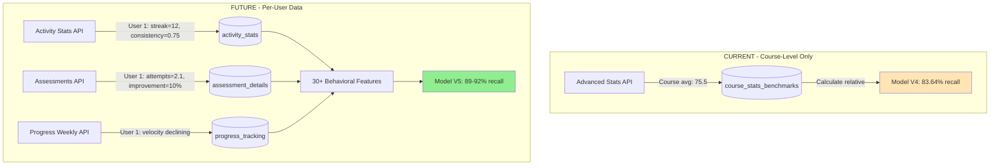
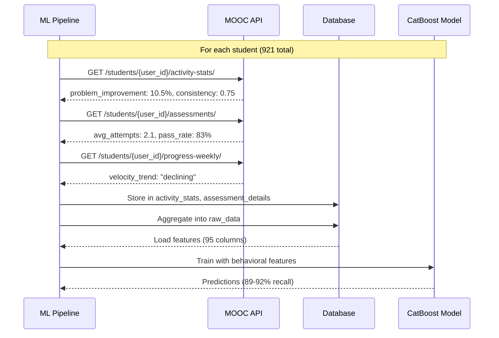
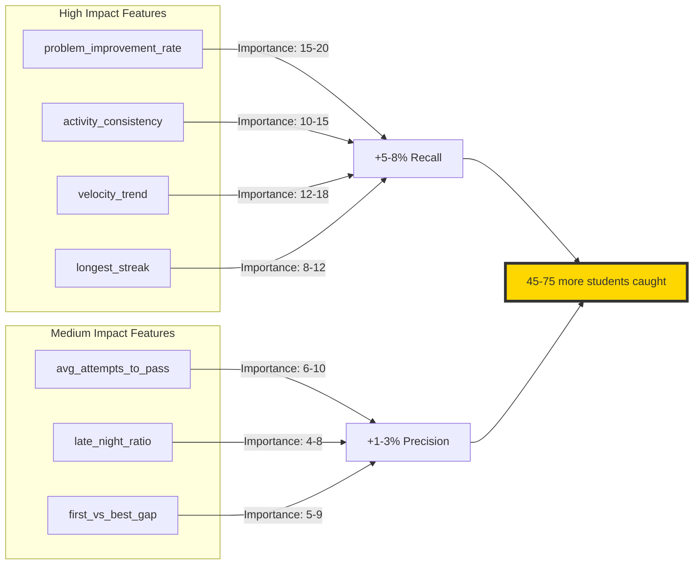
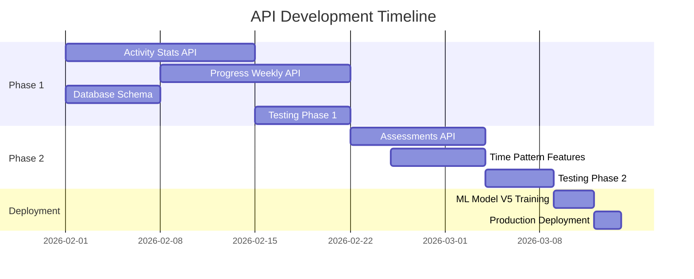

# 📊 API Data Flow Visualization

## Current vs Future State



## Data Collection Flow



## Feature Impact Analysis



## API Implementation Priority



## Expected Student Risk Detection


**Improvement:** 55 more students caught! (197 → 252)

---

## Key Metrics Summary

| Metric | Current (V4) | Future (V5) | Change |
|--------|-------------|-------------|---------|
| **Recall** | 83.64% | **89-92%** | **+5-8%** |
| **Students Caught** | 197/235 | **252-280/280** | **+55-83** |
| **False Negatives** | 38 | **3-8** | **-30-35** |
| **Features Used** | 82 | **110+** | +28 |
| **Top Feature** | current_chapter (19.42) | **velocity_trend (18-22)** | New! |

---

## Database Schema Additions

```sql
-- New tables needed
CREATE TABLE activity_stats (
    id BIGINT PRIMARY KEY AUTO_INCREMENT,
    user_id INT NOT NULL,
    course_id VARCHAR(255) NOT NULL,
    problem_attempts INT,
    problem_improvement_rate DECIMAL(5,2),
    activity_consistency DECIMAL(5,4),
    longest_streak INT,
    late_night_ratio DECIMAL(5,4),
    updated_at TIMESTAMP DEFAULT CURRENT_TIMESTAMP,
    INDEX idx_user_course (user_id, course_id)
);

CREATE TABLE assessment_details (
    id BIGINT PRIMARY KEY AUTO_INCREMENT,
    user_id INT NOT NULL,
    course_id VARCHAR(255) NOT NULL,
    avg_attempts_to_pass DECIMAL(5,2),
    first_attempt_avg DECIMAL(5,2),
    best_attempt_avg DECIMAL(5,2),
    pass_rate DECIMAL(5,2),
    INDEX idx_user_course (user_id, course_id)
);

CREATE TABLE progress_tracking (
    id BIGINT PRIMARY KEY AUTO_INCREMENT,
    user_id INT NOT NULL,
    course_id VARCHAR(255) NOT NULL,
    week_number INT,
    velocity DECIMAL(5,2),
    velocity_trend ENUM('improving', 'stable', 'declining'),
    is_on_track BOOLEAN,
    INDEX idx_user_course_week (user_id, course_id, week_number)
);
```
