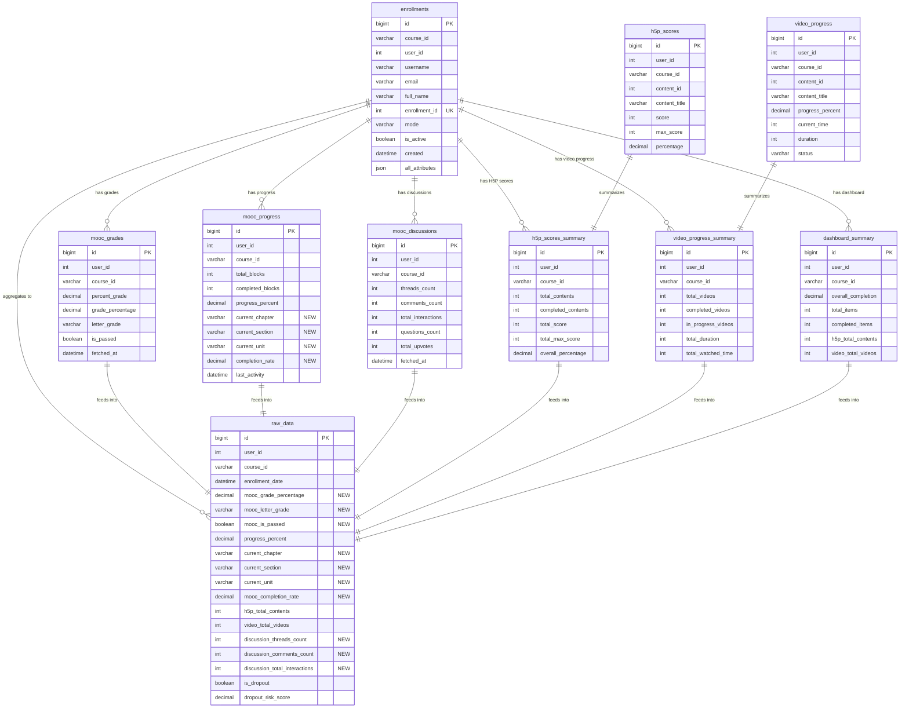

# Database Schema - ERD Diagram

## Database Structure với MOOC Export APIs



## API to Table Mapping

### H5P APIs → Tables

| API Endpoint | Target Tables |
|-------------|---------------|
| `/scores/{user_id}/{course_id}` | `h5p_scores`, `h5p_scores_summary` |
| `/video-progress/{user_id}/{course_id}` | `video_progress`, `video_progress_summary` |
| `/dashboard/{user_id}/{course_id}` | `dashboard_summary` |

### MOOC APIs → Tables

| API Endpoint | Target Tables |
|-------------|---------------|
| `/course-enrollments-attributes/{course_id}/` | `enrollments` |
| `/export/student-grades/{course_id}/` | **`mooc_grades`** ⭐ NEW |
| `/export/student-progress/{course_id}/` | **`mooc_progress`** (updated) ⭐ |
| `/export/student-discussions/{course_id}/` | **`mooc_discussions`** ⭐ NEW |
| `/export/complete-student-data/{course_id}/` | All tables above (aggregate) |

### Data Flow

```
┌─────────────────┐
│  MOOC APIs      │
│  - Enrollments  │
│  - Grades       │──┐
│  - Progress     │  │
│  - Discussions  │  │
└─────────────────┘  │
                     │
┌─────────────────┐  │
│  H5P APIs       │  │         ┌──────────────────┐
│  - Scores       │──┼────────▶│  Detail Tables   │
│  - Video        │  │         │  (mooc_grades,   │
│  - Dashboard    │  │         │   mooc_progress, │
└─────────────────┘  │         │   h5p_scores,    │
                     │         │   etc.)          │
                     │         └──────────────────┘
                     │                 │
                     │                 │
                     │                 ▼
                     │         ┌──────────────────┐
                     │         │  Summary Tables  │
                     └────────▶│  (h5p_summary,   │
                               │   video_summary) │
                               └──────────────────┘
                                       │
                                       │ Aggregate
                                       ▼
                               ┌──────────────────┐
                               │   raw_data       │
                               │  (ML Features)   │
                               └──────────────────┘
```

## Key Relationships

1. **One-to-One**: `(user_id, course_id)` is unique across all main tables
   - Each user has exactly one grade record per course
   - Each user has exactly one progress record per course
   - Etc.

2. **One-to-Many**: 
   - `enrollments` → `h5p_scores` (one user has many H5P content scores)
   - `enrollments` → `video_progress` (one user has many video progress records)

3. **Many-to-One Aggregation**:
   - Many detail tables → One `raw_data` record per user per course
   - Features are calculated and aggregated from all source tables

## Indexes Strategy

### Primary Indexes (Performance Critical)
- `(user_id, course_id)` - UNIQUE on all main tables
- `course_id` - For querying all students in a course
- `user_id` - For querying all courses for a student

### Secondary Indexes (Analytics)
- `grade_percentage`, `completion_rate` - For ranking/filtering
- `total_interactions` - For finding top contributors
- `fetched_at` - For data freshness queries
- `is_passed`, `is_dropout` - For classification queries

## Storage Estimates

Assuming:
- 1,000 students per course
- 10 courses
- Total: 10,000 records

### Table Sizes (Estimated)

| Table | Records | Est. Size per Record | Total Size |
|-------|---------|---------------------|------------|
| `enrollments` | 10,000 | 2 KB | ~20 MB |
| `mooc_grades` | 10,000 | 0.5 KB | ~5 MB |
| `mooc_progress` | 10,000 | 1 KB | ~10 MB |
| `mooc_discussions` | 10,000 | 0.5 KB | ~5 MB |
| `h5p_scores` | 100,000 | 0.3 KB | ~30 MB |
| `h5p_scores_summary` | 10,000 | 0.5 KB | ~5 MB |
| `video_progress` | 50,000 | 0.3 KB | ~15 MB |
| `video_progress_summary` | 10,000 | 0.5 KB | ~5 MB |
| `dashboard_summary` | 10,000 | 1 KB | ~10 MB |
| `raw_data` | 10,000 | 2 KB | ~20 MB |
| **TOTAL** | | | **~125 MB** |

Very manageable size for MySQL/MariaDB.
